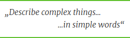
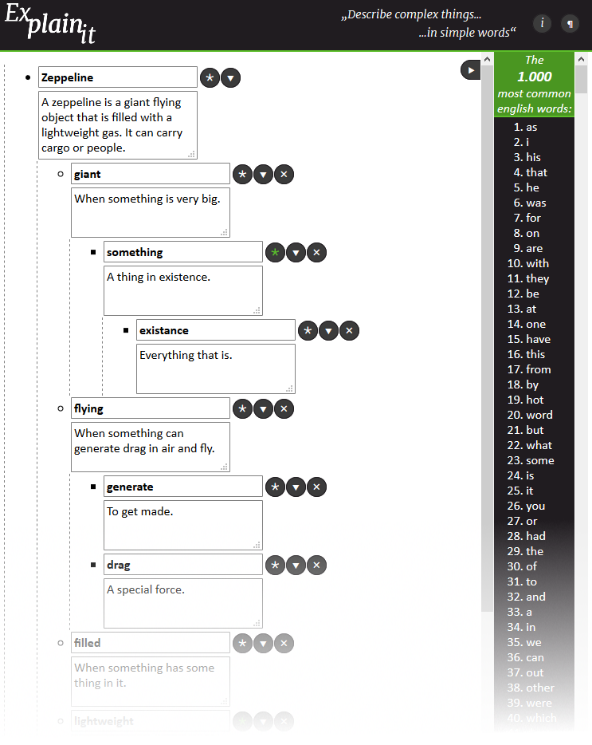
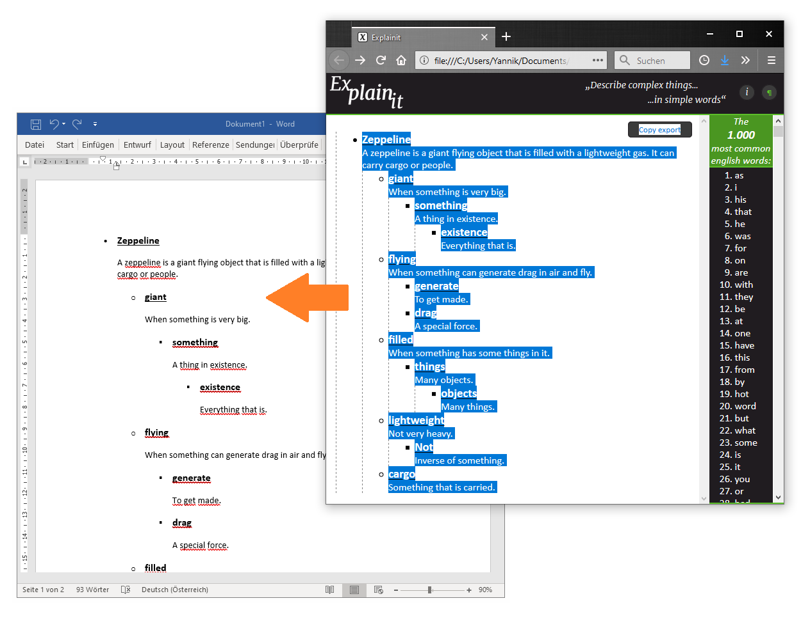

# Explainit
>A website for describing complex things ... in simple words! [Try it out!](https://tryops.github.io/explainit/)

## The Idea
The idea of this webpage is based on a core concept which is often used in programming or maths (abstraction). 
The idea is to group/define a specific concept as a set of "atomic" things under a specific term which you can then refer to/use in order to define other terms based on it. 
Thus a concept must not be explained or defined directly in one turn, but can be split up into many sub-explanations 
(and often you discover more properties of the explained subject in the process). This process is also called _"top-down"_- or _"bottom-up"_-method.

This is basically also how functions or objects in many programming languages and also mathematical proofs work! 
The twist is now to take this idea and apply it to language... the other way around!

## The Concept
You take a concept (with a name) you know and would like to explain (e.g. to someone else or to yourself), this can be any concept/subject as abstract or complicated as you like. 
Then you write it's name and the concept of it down with any terms you would like to use. 
All terms which are too complex on their own need extra explanations themselves as well, so you take these terms and write, oh...

You have the same routine again! If you did this over and over, it would repeat indefinitely! So how do you know when to stop explaining words (that are simple enough on their own)? And how do you know which words are too complex for now?

The approach is to stop when, for example, a child or a very average person could understand all the explanations of your "smallest" terms and could thus puzzle together the whole explanation based on these. 

Words that everyone can understand will most certainly be the words everyone uses on a daily basis and thus the **most**. 
The **most common words** of a language are the words everyone speaking that language should be familiar with (on average). These are our "atoms" for the explanations (of the concepts). 

So, if a word 
- can be explained with these "atoms" _(the most common words)_, it can be understood, 
- and if a word can't be explained only with these "atoms", the more complex terms that make up the explanation must themselves be explained with other words more clearly, and their explanations as well, and so on... 

Until you end up with explanations consisting only of the "atoms" of the _most common words_. Then the subject can be explained/formalized _"properly"_ for anyone to understand.  

## The Page
With this process of explanation (of a subject) you end up with an explanation model in the form of a tree. 
This is excactly what this webpage does, it generates you the tree _(and proper indentation/formatting)_ based on your explanations. 

For the most common words it uses a list of the [1000 Most Common English Words](https://1000mostcommonwords.com/1000-most-common-english-words/) which it checks against your words. 
If they are not within the list, they must be explained further. Also, if a word has been explained, it can be used in every other explanation (globally). _Thus, also recursive explanations are possible (but not recommended)._

On the page you are first prompted with two input fields, a title (the term you want to explain) and the explanation of the title. 
- If you have your explanation set up, you can press the 🞱-button next to it and **evaluate** the explanation for uncommon/unexplained words 
*(it also turns green if you don't press it, which indicates unexplained words and must be pressed)*. 

If any are found, they pop up beneath this explanation (indented) and must now again be explained...
Their sub-explanations are always indented to maintain a tree structure. 

- All sub-explanations of an explanation-entry can also be **collapsed/hidden** using the ⯆-button. This can reduce complexity when writing and can help to better keep track of unexplained branches. 
- You can also **remove** entries (and all of their sub-explanations/children!) with the 🞪-button.

When you are done, you can **export** your tree/list of explanations with the ¶-button (top right corner), copy the output and paste it into a word-document for example. 

## Inspiration
Even though this tool might not be very practical, it might help to grasp the underlying concept of the power of abstraction (and the _"top-down"_-/_"bottom-up"_-method), so, [give it a try](https://tryops.github.io/explainit/) and have fun!

This tool was inspired by the online list-outlining tools [Workflowy](https://workflowy.com) & [Dynalist](https://dynalist.io) and the book "[Thing Explainer](https://xkcd.com/thing-explainer/)" by Randall Munroe.
Also, of course, by the concept of abstraction. 

_Created by Yannik Wailzer (2019)_

_Written in plain HTML, CSS & JavaScript (no libraries used *)_

* now I know why people use JavaScript frameworks (doing animations the vanilla-way is hard!)...
